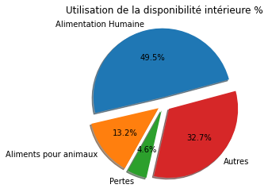
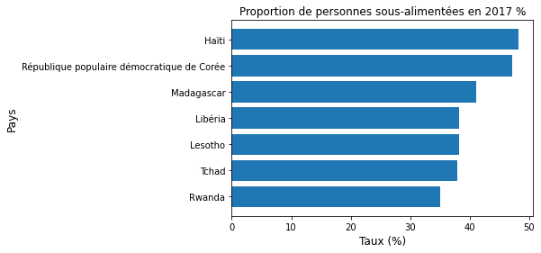
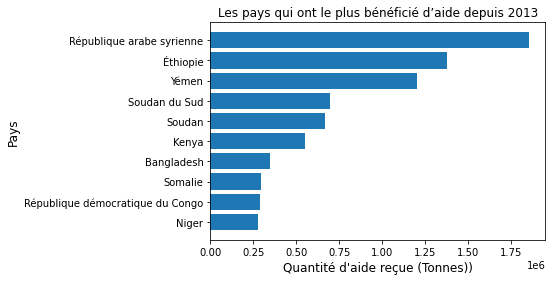
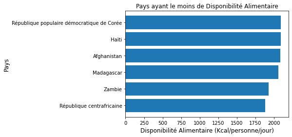
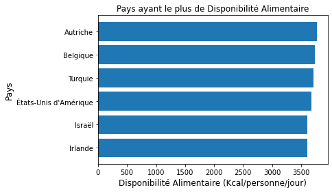
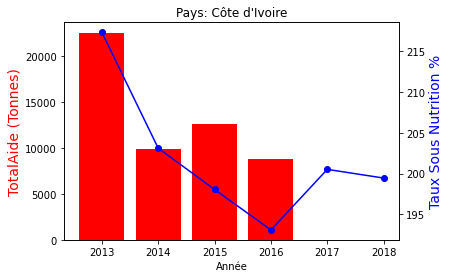
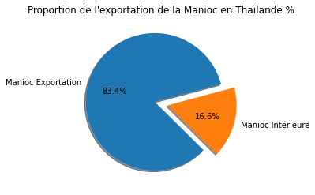

## PROJET 4 - Réalisez une étude de santé publique avec R ou Python

###  1) Importation des Librairies


```python
import pandas as pd
import numpy as np
import matplotlib.pyplot as plt
```

### 2) Importation des Données


```python
pop = pd.read_csv(r"Données\population.csv")
```


```python
aide = pd.read_csv(r"Données\aide_alimentaire.csv")
```


```python
dispo = pd.read_csv(r"Données\dispo_alimentaire.csv")
```


```python
sous = pd.read_csv(r"Données\sous_nutrition.csv")
```

### 3) Analyse, Nettoyage et  Preprocessing des Données

#### 3.1) Population


```python
# Analyse du Dataframe Population pour voir ses informations, type, valeurs manquants et pour générer ses analyses statistiques.
```


```python
pop.head()
```


<div>
<style scoped>
    .dataframe tbody tr th:only-of-type {
        vertical-align: middle;
    }

    .dataframe tbody tr th {
        vertical-align: top;
    }

    .dataframe thead th {
        text-align: right;
    }
</style>
<table border="1" class="dataframe">
  <thead>
    <tr style="text-align: right;">
      <th></th>
      <th>Zone</th>
      <th>Année</th>
      <th>Valeur</th>
    </tr>
  </thead>
  <tbody>
    <tr>
      <th>0</th>
      <td>Afghanistan</td>
      <td>2013</td>
      <td>32269.589</td>
    </tr>
    <tr>
      <th>1</th>
      <td>Afghanistan</td>
      <td>2014</td>
      <td>33370.794</td>
    </tr>
    <tr>
      <th>2</th>
      <td>Afghanistan</td>
      <td>2015</td>
      <td>34413.603</td>
    </tr>
    <tr>
      <th>3</th>
      <td>Afghanistan</td>
      <td>2016</td>
      <td>35383.032</td>
    </tr>
    <tr>
      <th>4</th>
      <td>Afghanistan</td>
      <td>2017</td>
      <td>36296.113</td>
    </tr>
  </tbody>
</table>
</div>


```python
pop.info()
```

    <class 'pandas.core.frame.DataFrame'>
    RangeIndex: 1416 entries, 0 to 1415
    Data columns (total 3 columns):
     #   Column  Non-Null Count  Dtype  
    ---  ------  --------------  -----  
     0   Zone    1416 non-null   object 
     1   Année   1416 non-null   int64  
     2   Valeur  1416 non-null   float64
    dtypes: float64(1), int64(1), object(1)
    memory usage: 33.3+ KB
    


```python
pop.describe()
```


<div>
<style scoped>
    .dataframe tbody tr th:only-of-type {
        vertical-align: middle;
    }

    .dataframe tbody tr th {
        vertical-align: top;
    }

    .dataframe thead th {
        text-align: right;
    }
</style>
<table border="1" class="dataframe">
  <thead>
    <tr style="text-align: right;">
      <th></th>
      <th>Année</th>
      <th>Valeur</th>
    </tr>
  </thead>
  <tbody>
    <tr>
      <th>count</th>
      <td>1416.000000</td>
      <td>1.416000e+03</td>
    </tr>
    <tr>
      <th>mean</th>
      <td>2015.500000</td>
      <td>3.144793e+04</td>
    </tr>
    <tr>
      <th>std</th>
      <td>1.708428</td>
      <td>1.300812e+05</td>
    </tr>
    <tr>
      <th>min</th>
      <td>2013.000000</td>
      <td>7.930000e-01</td>
    </tr>
    <tr>
      <th>25%</th>
      <td>2014.000000</td>
      <td>3.783410e+02</td>
    </tr>
    <tr>
      <th>50%</th>
      <td>2015.500000</td>
      <td>5.126480e+03</td>
    </tr>
    <tr>
      <th>75%</th>
      <td>2017.000000</td>
      <td>1.930666e+04</td>
    </tr>
    <tr>
      <th>max</th>
      <td>2018.000000</td>
      <td>1.427648e+06</td>
    </tr>
  </tbody>
</table>
</div>


```python
# Renommer la colonne "Valeur" pour "Total Population"
```


```python
pop = pop.rename(columns={"Valeur": "TotalPopulation"}) 
```


```python
# Conversion de la variable "Total Population" qui était exprimée en milliers d'habitants
```


```python
pop["TotalPopulation"]=pop["TotalPopulation"]*1000  
```


```python
# Création d'un nouveau dataframe que pour la population de 2017
```


```python
pop_17 = pop[pop["Année"] == 2017]
```

#### 3.2) Disponibilité Alimentaire


```python
# Analyse du Dataframe Population pour voir ses informations, type, valeurs manquants et pour générer des analyses statistiques.
```


```python
dispo.head()
```


<div>
<style scoped>
    .dataframe tbody tr th:only-of-type {
        vertical-align: middle;
    }

    .dataframe tbody tr th {
        vertical-align: top;
    }

    .dataframe thead th {
        text-align: right;
    }
</style>
<table border="1" class="dataframe">
  <thead>
    <tr style="text-align: right;">
      <th></th>
      <th>Zone</th>
      <th>Produit</th>
      <th>Origine</th>
      <th>Aliments pour animaux</th>
      <th>Autres Utilisations</th>
      <th>Disponibilité alimentaire (Kcal/personne/jour)</th>
      <th>Disponibilité alimentaire en quantité (kg/personne/an)</th>
      <th>Disponibilité de matière grasse en quantité (g/personne/jour)</th>
      <th>Disponibilité de protéines en quantité (g/personne/jour)</th>
      <th>Disponibilité intérieure</th>
      <th>Exportations - Quantité</th>
      <th>Importations - Quantité</th>
      <th>Nourriture</th>
      <th>Pertes</th>
      <th>Production</th>
      <th>Semences</th>
      <th>Traitement</th>
      <th>Variation de stock</th>
    </tr>
  </thead>
  <tbody>
    <tr>
      <th>0</th>
      <td>Afghanistan</td>
      <td>Abats Comestible</td>
      <td>animale</td>
      <td>NaN</td>
      <td>NaN</td>
      <td>5.0</td>
      <td>1.72</td>
      <td>0.20</td>
      <td>0.77</td>
      <td>53.0</td>
      <td>NaN</td>
      <td>NaN</td>
      <td>53.0</td>
      <td>NaN</td>
      <td>53.0</td>
      <td>NaN</td>
      <td>NaN</td>
      <td>NaN</td>
    </tr>
    <tr>
      <th>1</th>
      <td>Afghanistan</td>
      <td>Agrumes, Autres</td>
      <td>vegetale</td>
      <td>NaN</td>
      <td>NaN</td>
      <td>1.0</td>
      <td>1.29</td>
      <td>0.01</td>
      <td>0.02</td>
      <td>41.0</td>
      <td>2.0</td>
      <td>40.0</td>
      <td>39.0</td>
      <td>2.0</td>
      <td>3.0</td>
      <td>NaN</td>
      <td>NaN</td>
      <td>NaN</td>
    </tr>
    <tr>
      <th>2</th>
      <td>Afghanistan</td>
      <td>Aliments pour enfants</td>
      <td>vegetale</td>
      <td>NaN</td>
      <td>NaN</td>
      <td>1.0</td>
      <td>0.06</td>
      <td>0.01</td>
      <td>0.03</td>
      <td>2.0</td>
      <td>NaN</td>
      <td>2.0</td>
      <td>2.0</td>
      <td>NaN</td>
      <td>NaN</td>
      <td>NaN</td>
      <td>NaN</td>
      <td>NaN</td>
    </tr>
    <tr>
      <th>3</th>
      <td>Afghanistan</td>
      <td>Ananas</td>
      <td>vegetale</td>
      <td>NaN</td>
      <td>NaN</td>
      <td>0.0</td>
      <td>0.00</td>
      <td>NaN</td>
      <td>NaN</td>
      <td>0.0</td>
      <td>NaN</td>
      <td>0.0</td>
      <td>0.0</td>
      <td>NaN</td>
      <td>NaN</td>
      <td>NaN</td>
      <td>NaN</td>
      <td>NaN</td>
    </tr>
    <tr>
      <th>4</th>
      <td>Afghanistan</td>
      <td>Bananes</td>
      <td>vegetale</td>
      <td>NaN</td>
      <td>NaN</td>
      <td>4.0</td>
      <td>2.70</td>
      <td>0.02</td>
      <td>0.05</td>
      <td>82.0</td>
      <td>NaN</td>
      <td>82.0</td>
      <td>82.0</td>
      <td>NaN</td>
      <td>NaN</td>
      <td>NaN</td>
      <td>NaN</td>
      <td>NaN</td>
    </tr>
  </tbody>
</table>
</div>


```python
dispo.info()
```

    <class 'pandas.core.frame.DataFrame'>
    RangeIndex: 15605 entries, 0 to 15604
    Data columns (total 18 columns):
     #   Column                                                         Non-Null Count  Dtype  
    ---  ------                                                         --------------  -----  
     0   Zone                                                           15605 non-null  object 
     1   Produit                                                        15605 non-null  object 
     2   Origine                                                        15605 non-null  object 
     3   Aliments pour animaux                                          2720 non-null   float64
     4   Autres Utilisations                                            5496 non-null   float64
     5   Disponibilité alimentaire (Kcal/personne/jour)                 14241 non-null  float64
     6   Disponibilité alimentaire en quantité (kg/personne/an)         14015 non-null  float64
     7   Disponibilité de matière grasse en quantité (g/personne/jour)  11794 non-null  float64
     8   Disponibilité de protéines en quantité (g/personne/jour)       11561 non-null  float64
     9   Disponibilité intérieure                                       15382 non-null  float64
     10  Exportations - Quantité                                        12226 non-null  float64
     11  Importations - Quantité                                        14852 non-null  float64
     12  Nourriture                                                     14015 non-null  float64
     13  Pertes                                                         4278 non-null   float64
     14  Production                                                     9180 non-null   float64
     15  Semences                                                       2091 non-null   float64
     16  Traitement                                                     2292 non-null   float64
     17  Variation de stock                                             6776 non-null   float64
    dtypes: float64(15), object(3)
    memory usage: 2.1+ MB
    


```python
dispo.describe()
```


<div>
<style scoped>
    .dataframe tbody tr th:only-of-type {
        vertical-align: middle;
    }

    .dataframe tbody tr th {
        vertical-align: top;
    }

    .dataframe thead th {
        text-align: right;
    }
</style>
<table border="1" class="dataframe">
  <thead>
    <tr style="text-align: right;">
      <th></th>
      <th>Aliments pour animaux</th>
      <th>Autres Utilisations</th>
      <th>Disponibilité alimentaire (Kcal/personne/jour)</th>
      <th>Disponibilité alimentaire en quantité (kg/personne/an)</th>
      <th>Disponibilité de matière grasse en quantité (g/personne/jour)</th>
      <th>Disponibilité de protéines en quantité (g/personne/jour)</th>
      <th>Disponibilité intérieure</th>
      <th>Exportations - Quantité</th>
      <th>Importations - Quantité</th>
      <th>Nourriture</th>
      <th>Pertes</th>
      <th>Production</th>
      <th>Semences</th>
      <th>Traitement</th>
      <th>Variation de stock</th>
    </tr>
  </thead>
  <tbody>
    <tr>
      <th>count</th>
      <td>2720.000000</td>
      <td>5496.000000</td>
      <td>14241.000000</td>
      <td>14015.000000</td>
      <td>11794.000000</td>
      <td>11561.000000</td>
      <td>15382.000000</td>
      <td>12226.000000</td>
      <td>14852.000000</td>
      <td>14015.000000</td>
      <td>4278.000000</td>
      <td>9180.000000</td>
      <td>2091.000000</td>
      <td>2292.000000</td>
      <td>6776.000000</td>
    </tr>
    <tr>
      <th>mean</th>
      <td>479.501838</td>
      <td>157.391376</td>
      <td>34.789832</td>
      <td>8.719368</td>
      <td>1.283111</td>
      <td>1.223608</td>
      <td>640.293460</td>
      <td>110.596925</td>
      <td>87.264543</td>
      <td>347.931359</td>
      <td>106.053763</td>
      <td>1090.379085</td>
      <td>73.974653</td>
      <td>961.905323</td>
      <td>-15.407615</td>
    </tr>
    <tr>
      <th>std</th>
      <td>4240.119637</td>
      <td>5076.785816</td>
      <td>107.287655</td>
      <td>24.618223</td>
      <td>3.680399</td>
      <td>3.598686</td>
      <td>9067.267153</td>
      <td>1053.318990</td>
      <td>717.372714</td>
      <td>4475.704458</td>
      <td>1113.100416</td>
      <td>12067.344094</td>
      <td>528.069224</td>
      <td>10381.795904</td>
      <td>549.834540</td>
    </tr>
    <tr>
      <th>min</th>
      <td>0.000000</td>
      <td>0.000000</td>
      <td>-21.000000</td>
      <td>-1.930000</td>
      <td>-0.030000</td>
      <td>-0.370000</td>
      <td>-3430.000000</td>
      <td>-41.000000</td>
      <td>-201.000000</td>
      <td>-246.000000</td>
      <td>0.000000</td>
      <td>0.000000</td>
      <td>0.000000</td>
      <td>-19.000000</td>
      <td>-39863.000000</td>
    </tr>
    <tr>
      <th>25%</th>
      <td>0.000000</td>
      <td>0.000000</td>
      <td>0.000000</td>
      <td>0.060000</td>
      <td>0.010000</td>
      <td>0.010000</td>
      <td>0.000000</td>
      <td>0.000000</td>
      <td>0.000000</td>
      <td>0.000000</td>
      <td>0.000000</td>
      <td>2.000000</td>
      <td>0.000000</td>
      <td>0.000000</td>
      <td>0.000000</td>
    </tr>
    <tr>
      <th>50%</th>
      <td>4.000000</td>
      <td>0.000000</td>
      <td>4.000000</td>
      <td>0.830000</td>
      <td>0.080000</td>
      <td>0.100000</td>
      <td>7.000000</td>
      <td>0.000000</td>
      <td>2.000000</td>
      <td>5.000000</td>
      <td>4.000000</td>
      <td>22.000000</td>
      <td>2.000000</td>
      <td>6.000000</td>
      <td>0.000000</td>
    </tr>
    <tr>
      <th>75%</th>
      <td>74.000000</td>
      <td>4.000000</td>
      <td>21.000000</td>
      <td>5.190000</td>
      <td>0.630000</td>
      <td>0.660000</td>
      <td>76.750000</td>
      <td>9.000000</td>
      <td>18.000000</td>
      <td>52.000000</td>
      <td>26.000000</td>
      <td>191.250000</td>
      <td>17.000000</td>
      <td>69.000000</td>
      <td>0.000000</td>
    </tr>
    <tr>
      <th>max</th>
      <td>150000.000000</td>
      <td>347309.000000</td>
      <td>1711.000000</td>
      <td>430.760000</td>
      <td>60.760000</td>
      <td>54.970000</td>
      <td>739267.000000</td>
      <td>42797.000000</td>
      <td>63381.000000</td>
      <td>426850.000000</td>
      <td>55047.000000</td>
      <td>739267.000000</td>
      <td>17060.000000</td>
      <td>326711.000000</td>
      <td>5284.000000</td>
    </tr>
  </tbody>
</table>
</div>


#### 3.3) Sous Nutrition


```python
# Analyse du Dataframe Population pour voir ses informations, type, valeurs manquants et pour générer des analyses statistiques.
```


```python
sous.head()
```


<div>
<style scoped>
    .dataframe tbody tr th:only-of-type {
        vertical-align: middle;
    }

    .dataframe tbody tr th {
        vertical-align: top;
    }

    .dataframe thead th {
        text-align: right;
    }
</style>
<table border="1" class="dataframe">
  <thead>
    <tr style="text-align: right;">
      <th></th>
      <th>Zone</th>
      <th>Année</th>
      <th>Valeur</th>
    </tr>
  </thead>
  <tbody>
    <tr>
      <th>0</th>
      <td>Afghanistan</td>
      <td>2012-2014</td>
      <td>8.6</td>
    </tr>
    <tr>
      <th>1</th>
      <td>Afghanistan</td>
      <td>2013-2015</td>
      <td>8.8</td>
    </tr>
    <tr>
      <th>2</th>
      <td>Afghanistan</td>
      <td>2014-2016</td>
      <td>8.9</td>
    </tr>
    <tr>
      <th>3</th>
      <td>Afghanistan</td>
      <td>2015-2017</td>
      <td>9.7</td>
    </tr>
    <tr>
      <th>4</th>
      <td>Afghanistan</td>
      <td>2016-2018</td>
      <td>10.5</td>
    </tr>
  </tbody>
</table>
</div>


```python
sous.info()
```

    <class 'pandas.core.frame.DataFrame'>
    RangeIndex: 1218 entries, 0 to 1217
    Data columns (total 3 columns):
     #   Column  Non-Null Count  Dtype 
    ---  ------  --------------  ----- 
     0   Zone    1218 non-null   object
     1   Année   1218 non-null   object
     2   Valeur  624 non-null    object
    dtypes: object(3)
    memory usage: 28.7+ KB
    


```python
sous.describe()
```


<div>
<style scoped>
    .dataframe tbody tr th:only-of-type {
        vertical-align: middle;
    }

    .dataframe tbody tr th {
        vertical-align: top;
    }

    .dataframe thead th {
        text-align: right;
    }
</style>
<table border="1" class="dataframe">
  <thead>
    <tr style="text-align: right;">
      <th></th>
      <th>Zone</th>
      <th>Année</th>
      <th>Valeur</th>
    </tr>
  </thead>
  <tbody>
    <tr>
      <th>count</th>
      <td>1218</td>
      <td>1218</td>
      <td>624</td>
    </tr>
    <tr>
      <th>unique</th>
      <td>203</td>
      <td>6</td>
      <td>139</td>
    </tr>
    <tr>
      <th>top</th>
      <td>Afghanistan</td>
      <td>2012-2014</td>
      <td>&lt;0.1</td>
    </tr>
    <tr>
      <th>freq</th>
      <td>6</td>
      <td>203</td>
      <td>120</td>
    </tr>
  </tbody>
</table>
</div>


```python
# Remplacer les valeurs de la collune "Année" pour faire la jointure avec le dataframe Sous Nutrition 2017 après
```


```python
sous["Année"].replace(["2012-2014", "2013-2015", "2014-2016","2015-2017","2016-2018","2017-2019"],
                      [2013,2014,2015,2016,2017,2018], inplace= True)
```


```python
# Renommer la colonne "Valeur" pour "Total Population"
```


```python
sous= sous.rename(columns={"Valeur": "TotalSousNutri"})
```


```python
# Accéder à un groupe de lignes pour les remplacer
```


```python
sous.loc[sous["TotalSousNutri"] == "<0.1"] = "0.1"
```


```python
# Conversion du type de la colonne "TotalSousNutri" en float
```


```python
sous["TotalSousNutri"] = pd.to_numeric(sous["TotalSousNutri"])
```


```python
# Conversion de la variable "Total Sous Nutri" qui était exprimée en millions d'habitants
```


```python
sous["TotalSousNutri"]=sous["TotalSousNutri"]*1000000
```


```python
# Criation d'un nouveau dataframe que pour la sous nutrition de 2017
```


```python
sous_17= sous[sous["Année"] == 2017]
```

#### 3.4) Aide Alimentaire


```python
aide.head()
```


<div>
<style scoped>
    .dataframe tbody tr th:only-of-type {
        vertical-align: middle;
    }

    .dataframe tbody tr th {
        vertical-align: top;
    }

    .dataframe thead th {
        text-align: right;
    }
</style>
<table border="1" class="dataframe">
  <thead>
    <tr style="text-align: right;">
      <th></th>
      <th>Pays bénéficiaire</th>
      <th>Année</th>
      <th>Produit</th>
      <th>Valeur</th>
    </tr>
  </thead>
  <tbody>
    <tr>
      <th>0</th>
      <td>Afghanistan</td>
      <td>2013</td>
      <td>Autres non-céréales</td>
      <td>682</td>
    </tr>
    <tr>
      <th>1</th>
      <td>Afghanistan</td>
      <td>2014</td>
      <td>Autres non-céréales</td>
      <td>335</td>
    </tr>
    <tr>
      <th>2</th>
      <td>Afghanistan</td>
      <td>2013</td>
      <td>Blé et Farin</td>
      <td>39224</td>
    </tr>
    <tr>
      <th>3</th>
      <td>Afghanistan</td>
      <td>2014</td>
      <td>Blé et Farin</td>
      <td>15160</td>
    </tr>
    <tr>
      <th>4</th>
      <td>Afghanistan</td>
      <td>2013</td>
      <td>Céréales</td>
      <td>40504</td>
    </tr>
  </tbody>
</table>
</div>


```python
aide.info()
```

    <class 'pandas.core.frame.DataFrame'>
    RangeIndex: 1475 entries, 0 to 1474
    Data columns (total 4 columns):
     #   Column             Non-Null Count  Dtype 
    ---  ------             --------------  ----- 
     0   Pays bénéficiaire  1475 non-null   object
     1   Année              1475 non-null   int64 
     2   Produit            1475 non-null   object
     3   Valeur             1475 non-null   int64 
    dtypes: int64(2), object(2)
    memory usage: 46.2+ KB
    


```python
aide.describe()
```


<div>
<style scoped>
    .dataframe tbody tr th:only-of-type {
        vertical-align: middle;
    }

    .dataframe tbody tr th {
        vertical-align: top;
    }

    .dataframe thead th {
        text-align: right;
    }
</style>
<table border="1" class="dataframe">
  <thead>
    <tr style="text-align: right;">
      <th></th>
      <th>Année</th>
      <th>Valeur</th>
    </tr>
  </thead>
  <tbody>
    <tr>
      <th>count</th>
      <td>1475.000000</td>
      <td>1475.000000</td>
    </tr>
    <tr>
      <th>mean</th>
      <td>2014.054237</td>
      <td>7481.966780</td>
    </tr>
    <tr>
      <th>std</th>
      <td>0.946916</td>
      <td>23339.531424</td>
    </tr>
    <tr>
      <th>min</th>
      <td>2013.000000</td>
      <td>0.000000</td>
    </tr>
    <tr>
      <th>25%</th>
      <td>2013.000000</td>
      <td>287.500000</td>
    </tr>
    <tr>
      <th>50%</th>
      <td>2014.000000</td>
      <td>1178.000000</td>
    </tr>
    <tr>
      <th>75%</th>
      <td>2015.000000</td>
      <td>4334.500000</td>
    </tr>
    <tr>
      <th>max</th>
      <td>2016.000000</td>
      <td>265013.000000</td>
    </tr>
  </tbody>
</table>
</div>


```python
# Renommer la colonne "Pays bénéficiaire" pour "Zone" 
```


```python
aide= aide.rename(columns={"Pays bénéficiaire": "Zone"})
```


```python
# Renommer la colonne "Valeur" pour "TotalAide" 
```


```python
aide= aide.rename(columns={"Valeur": "TotalAide"})
```


```python
aide["TotalAide"]=aide["TotalAide"]*1000
```

## DEMANDES DE MARC

### Question 1: La proportion de personnes en état de sous-nutrition:


```python
# Supprimer la colonne "Année" dans les dataframes pop_17 et sous_17 pour faire la jointure
```


```python
pop_17 = pop_17.drop("Année", axis=1)
```


```python
sous_17 = sous_17.drop("Année", axis=1)
```


```python
# Jointure LEFT JOIN du dataframe pop_17 et sous_17 à partir de la zone en commun 
```


```python
PxS2017 = pd.merge(pop_17,sous_17,on='Zone',how='left')
```


```python
# Création de une nouvelle colonne "Taux " pour obtenir la proportion de personnes en état de sous-nutrition pour chaque pays
```


```python
PxS2017["Taux"] = PxS2017["TotalSousNutri"]/PxS2017["TotalPopulation"]*100
```


```python
PxS2017
```


<div>
<style scoped>
    .dataframe tbody tr th:only-of-type {
        vertical-align: middle;
    }

    .dataframe tbody tr th {
        vertical-align: top;
    }

    .dataframe thead th {
        text-align: right;
    }
</style>
<table border="1" class="dataframe">
  <thead>
    <tr style="text-align: right;">
      <th></th>
      <th>Zone</th>
      <th>TotalPopulation</th>
      <th>TotalSousNutri</th>
      <th>Taux</th>
    </tr>
  </thead>
  <tbody>
    <tr>
      <th>0</th>
      <td>Afghanistan</td>
      <td>36296113.0</td>
      <td>10500000.0</td>
      <td>28.928718</td>
    </tr>
    <tr>
      <th>1</th>
      <td>Afrique du Sud</td>
      <td>57009756.0</td>
      <td>3100000.0</td>
      <td>5.437666</td>
    </tr>
    <tr>
      <th>2</th>
      <td>Albanie</td>
      <td>2884169.0</td>
      <td>100000.0</td>
      <td>3.467203</td>
    </tr>
    <tr>
      <th>3</th>
      <td>Algérie</td>
      <td>41389189.0</td>
      <td>1300000.0</td>
      <td>3.140917</td>
    </tr>
    <tr>
      <th>4</th>
      <td>Allemagne</td>
      <td>82658409.0</td>
      <td>NaN</td>
      <td>NaN</td>
    </tr>
    <tr>
      <th>...</th>
      <td>...</td>
      <td>...</td>
      <td>...</td>
      <td>...</td>
    </tr>
    <tr>
      <th>231</th>
      <td>Venezuela (République bolivarienne du)</td>
      <td>29402484.0</td>
      <td>8000000.0</td>
      <td>27.208586</td>
    </tr>
    <tr>
      <th>232</th>
      <td>Viet Nam</td>
      <td>94600648.0</td>
      <td>6500000.0</td>
      <td>6.870989</td>
    </tr>
    <tr>
      <th>233</th>
      <td>Yémen</td>
      <td>27834819.0</td>
      <td>NaN</td>
      <td>NaN</td>
    </tr>
    <tr>
      <th>234</th>
      <td>Zambie</td>
      <td>16853599.0</td>
      <td>NaN</td>
      <td>NaN</td>
    </tr>
    <tr>
      <th>235</th>
      <td>Zimbabwe</td>
      <td>14236595.0</td>
      <td>NaN</td>
      <td>NaN</td>
    </tr>
  </tbody>
</table>
<p>236 rows × 4 columns</p>
</div>


```python
# Calcul de la proportion de personnes en état de sous-nutrition
```


```python
resultat= round(PxS2017["TotalSousNutri"].sum()/PxS2017["TotalPopulation"].sum()*100,2)
```


```python
print("La proportion de personnes en état de sous-nutrition est",resultat ,"%.")
```

    La proportion de personnes en état de sous-nutrition est 7.1 %.
    

### Question 2: Le nombre théorique de personnes qui pourraient être nourries:


```python
# Création d'un nouveau dataframe à partir de la disponibilité alimentaire mondiale
```


```python
dispo2= dispo[["Zone", "Produit","Disponibilité alimentaire (Kcal/personne/jour)","Origine"]]
```


```python
# Création d'un nouveau dataframe pour la population 
```


```python
dispo3= PxS2017[["Zone", "TotalPopulation"]]
```


```python
# Valeur du besoin énergétique moyen (kcal/jour) definit par L’Agence nationale de sécurité sanitaire de l’alimentationl (ANSES)
```


```python
varkcal = 2400
```


```python
# Jointure LEFT JOIN du dataframe dispo2 et dispo3 pour obtenir la disponibilité alimentaire mondiale total
```


```python
dispofinal = pd.merge(dispo2,dispo3,on='Zone',how='left')
```


```python
# Création de une nouvelle colonne "DispoTotalAlimentaire " pour obtenir la disponibilité alimentaire mondiale total par produit
```


```python
dispofinal["DispoTotalAlimentaire"] = dispofinal["Disponibilité alimentaire (Kcal/personne/jour)"]* dispofinal["TotalPopulation"]
```


```python
dispofinal
```


<div>
<style scoped>
    .dataframe tbody tr th:only-of-type {
        vertical-align: middle;
    }

    .dataframe tbody tr th {
        vertical-align: top;
    }

    .dataframe thead th {
        text-align: right;
    }
</style>
<table border="1" class="dataframe">
  <thead>
    <tr style="text-align: right;">
      <th></th>
      <th>Zone</th>
      <th>Produit</th>
      <th>Disponibilité alimentaire (Kcal/personne/jour)</th>
      <th>Origine</th>
      <th>TotalPopulation</th>
      <th>DispoTotalAlimentaire</th>
    </tr>
  </thead>
  <tbody>
    <tr>
      <th>0</th>
      <td>Afghanistan</td>
      <td>Abats Comestible</td>
      <td>5.0</td>
      <td>animale</td>
      <td>36296113.0</td>
      <td>181480565.0</td>
    </tr>
    <tr>
      <th>1</th>
      <td>Afghanistan</td>
      <td>Agrumes, Autres</td>
      <td>1.0</td>
      <td>vegetale</td>
      <td>36296113.0</td>
      <td>36296113.0</td>
    </tr>
    <tr>
      <th>2</th>
      <td>Afghanistan</td>
      <td>Aliments pour enfants</td>
      <td>1.0</td>
      <td>vegetale</td>
      <td>36296113.0</td>
      <td>36296113.0</td>
    </tr>
    <tr>
      <th>3</th>
      <td>Afghanistan</td>
      <td>Ananas</td>
      <td>0.0</td>
      <td>vegetale</td>
      <td>36296113.0</td>
      <td>0.0</td>
    </tr>
    <tr>
      <th>4</th>
      <td>Afghanistan</td>
      <td>Bananes</td>
      <td>4.0</td>
      <td>vegetale</td>
      <td>36296113.0</td>
      <td>145184452.0</td>
    </tr>
    <tr>
      <th>...</th>
      <td>...</td>
      <td>...</td>
      <td>...</td>
      <td>...</td>
      <td>...</td>
      <td>...</td>
    </tr>
    <tr>
      <th>15600</th>
      <td>Îles Salomon</td>
      <td>Viande de Suides</td>
      <td>45.0</td>
      <td>animale</td>
      <td>636039.0</td>
      <td>28621755.0</td>
    </tr>
    <tr>
      <th>15601</th>
      <td>Îles Salomon</td>
      <td>Viande de Volailles</td>
      <td>11.0</td>
      <td>animale</td>
      <td>636039.0</td>
      <td>6996429.0</td>
    </tr>
    <tr>
      <th>15602</th>
      <td>Îles Salomon</td>
      <td>Viande, Autre</td>
      <td>0.0</td>
      <td>animale</td>
      <td>636039.0</td>
      <td>0.0</td>
    </tr>
    <tr>
      <th>15603</th>
      <td>Îles Salomon</td>
      <td>Vin</td>
      <td>0.0</td>
      <td>vegetale</td>
      <td>636039.0</td>
      <td>0.0</td>
    </tr>
    <tr>
      <th>15604</th>
      <td>Îles Salomon</td>
      <td>Épices, Autres</td>
      <td>4.0</td>
      <td>vegetale</td>
      <td>636039.0</td>
      <td>2544156.0</td>
    </tr>
  </tbody>
</table>
<p>15605 rows × 6 columns</p>
</div>


```python
# Calcul du nombre de personnes qui pourraient être nourries:
```


```python
Total = round(dispofinal["DispoTotalAlimentaire"].sum()/varkcal)
```


```python
print(f"La disponibilite alimentaire en 2017 pouvait nourrir {Total} de personnes.", "Il corresponde à ", round(((Total/PxS2017["TotalPopulation"].sum())-1) *100,2),"% en plus de la population en 2017.")
```

    La disponibilite alimentaire en 2017 pouvait nourrir 8716243595 de personnes. Il corresponde à  15.48 % en plus de la population en 2017.
    

### Question 3: Idem pour la disponibilité alimentaire des produits végétaux:


```python
# Création d'un nouveau dataframe que disponibilité alimentaire des produits végétaux
```


```python
dispoveg =dispofinal[dispofinal["Origine"]=="vegetale"]
```


```python
# Calcul du nombre de personnes qui pourraient être nourries avec les produits végétaux
```


```python
TotalVegetal= round(dispoveg["DispoTotalAlimentaire"].sum()/varkcal)
```


```python
print(f"La disponibilite alimentaire vegetal en 2017 pouvait nourrir {TotalVegetal} de personnes.", "Il corresponde à", round(((TotalVegetal/PxS2017["TotalPopulation"].sum())) *100,2),"% de la population en 2017.")
```

    La disponibilite alimentaire vegetal en 2017 pouvait nourrir 7191985088 de personnes. Il corresponde à 95.28 % de la population en 2017.
    

### Question 4: L’utilisation de la disponibilité intérieure, en particulier la part qui est attribuée à l’alimentation animale, celle qui est perdue et celle qui est concrètement utilisée pour l'alimentation humaine


```python
# Remplacer les valeurs "nan" pour 0 et realizer la somme
```


```python
dispoNa=dispo.replace(np.nan, 0)
```


```python
# Création de une nouvelle colonne "DispoAlimentaire" pour vérifier le résultat et la formule du Julien
```


```python
dispoNa["DispoAlimentaire"]= dispoNa["Production"]+dispoNa["Importations - Quantité"]-dispoNa["Exportations - Quantité"]+dispoNa["Variation de stock"]
```


```python
dispoNa
```


<div>
<style scoped>
    .dataframe tbody tr th:only-of-type {
        vertical-align: middle;
    }

    .dataframe tbody tr th {
        vertical-align: top;
    }

    .dataframe thead th {
        text-align: right;
    }
</style>
<table border="1" class="dataframe">
  <thead>
    <tr style="text-align: right;">
      <th></th>
      <th>Zone</th>
      <th>Produit</th>
      <th>Origine</th>
      <th>Aliments pour animaux</th>
      <th>Autres Utilisations</th>
      <th>Disponibilité alimentaire (Kcal/personne/jour)</th>
      <th>Disponibilité alimentaire en quantité (kg/personne/an)</th>
      <th>Disponibilité de matière grasse en quantité (g/personne/jour)</th>
      <th>Disponibilité de protéines en quantité (g/personne/jour)</th>
      <th>Disponibilité intérieure</th>
      <th>Exportations - Quantité</th>
      <th>Importations - Quantité</th>
      <th>Nourriture</th>
      <th>Pertes</th>
      <th>Production</th>
      <th>Semences</th>
      <th>Traitement</th>
      <th>Variation de stock</th>
      <th>DispoAlimentaire</th>
    </tr>
  </thead>
  <tbody>
    <tr>
      <th>0</th>
      <td>Afghanistan</td>
      <td>Abats Comestible</td>
      <td>animale</td>
      <td>0.0</td>
      <td>0.0</td>
      <td>5.0</td>
      <td>1.72</td>
      <td>0.20</td>
      <td>0.77</td>
      <td>53.0</td>
      <td>0.0</td>
      <td>0.0</td>
      <td>53.0</td>
      <td>0.0</td>
      <td>53.0</td>
      <td>0.0</td>
      <td>0.0</td>
      <td>0.0</td>
      <td>53.0</td>
    </tr>
    <tr>
      <th>1</th>
      <td>Afghanistan</td>
      <td>Agrumes, Autres</td>
      <td>vegetale</td>
      <td>0.0</td>
      <td>0.0</td>
      <td>1.0</td>
      <td>1.29</td>
      <td>0.01</td>
      <td>0.02</td>
      <td>41.0</td>
      <td>2.0</td>
      <td>40.0</td>
      <td>39.0</td>
      <td>2.0</td>
      <td>3.0</td>
      <td>0.0</td>
      <td>0.0</td>
      <td>0.0</td>
      <td>41.0</td>
    </tr>
    <tr>
      <th>2</th>
      <td>Afghanistan</td>
      <td>Aliments pour enfants</td>
      <td>vegetale</td>
      <td>0.0</td>
      <td>0.0</td>
      <td>1.0</td>
      <td>0.06</td>
      <td>0.01</td>
      <td>0.03</td>
      <td>2.0</td>
      <td>0.0</td>
      <td>2.0</td>
      <td>2.0</td>
      <td>0.0</td>
      <td>0.0</td>
      <td>0.0</td>
      <td>0.0</td>
      <td>0.0</td>
      <td>2.0</td>
    </tr>
    <tr>
      <th>3</th>
      <td>Afghanistan</td>
      <td>Ananas</td>
      <td>vegetale</td>
      <td>0.0</td>
      <td>0.0</td>
      <td>0.0</td>
      <td>0.00</td>
      <td>0.00</td>
      <td>0.00</td>
      <td>0.0</td>
      <td>0.0</td>
      <td>0.0</td>
      <td>0.0</td>
      <td>0.0</td>
      <td>0.0</td>
      <td>0.0</td>
      <td>0.0</td>
      <td>0.0</td>
      <td>0.0</td>
    </tr>
    <tr>
      <th>4</th>
      <td>Afghanistan</td>
      <td>Bananes</td>
      <td>vegetale</td>
      <td>0.0</td>
      <td>0.0</td>
      <td>4.0</td>
      <td>2.70</td>
      <td>0.02</td>
      <td>0.05</td>
      <td>82.0</td>
      <td>0.0</td>
      <td>82.0</td>
      <td>82.0</td>
      <td>0.0</td>
      <td>0.0</td>
      <td>0.0</td>
      <td>0.0</td>
      <td>0.0</td>
      <td>82.0</td>
    </tr>
    <tr>
      <th>...</th>
      <td>...</td>
      <td>...</td>
      <td>...</td>
      <td>...</td>
      <td>...</td>
      <td>...</td>
      <td>...</td>
      <td>...</td>
      <td>...</td>
      <td>...</td>
      <td>...</td>
      <td>...</td>
      <td>...</td>
      <td>...</td>
      <td>...</td>
      <td>...</td>
      <td>...</td>
      <td>...</td>
      <td>...</td>
    </tr>
    <tr>
      <th>15600</th>
      <td>Îles Salomon</td>
      <td>Viande de Suides</td>
      <td>animale</td>
      <td>0.0</td>
      <td>0.0</td>
      <td>45.0</td>
      <td>4.70</td>
      <td>4.28</td>
      <td>1.41</td>
      <td>3.0</td>
      <td>0.0</td>
      <td>0.0</td>
      <td>3.0</td>
      <td>0.0</td>
      <td>2.0</td>
      <td>0.0</td>
      <td>0.0</td>
      <td>0.0</td>
      <td>2.0</td>
    </tr>
    <tr>
      <th>15601</th>
      <td>Îles Salomon</td>
      <td>Viande de Volailles</td>
      <td>animale</td>
      <td>0.0</td>
      <td>0.0</td>
      <td>11.0</td>
      <td>3.34</td>
      <td>0.69</td>
      <td>1.14</td>
      <td>2.0</td>
      <td>0.0</td>
      <td>2.0</td>
      <td>2.0</td>
      <td>0.0</td>
      <td>0.0</td>
      <td>0.0</td>
      <td>0.0</td>
      <td>0.0</td>
      <td>2.0</td>
    </tr>
    <tr>
      <th>15602</th>
      <td>Îles Salomon</td>
      <td>Viande, Autre</td>
      <td>animale</td>
      <td>0.0</td>
      <td>0.0</td>
      <td>0.0</td>
      <td>0.06</td>
      <td>0.00</td>
      <td>0.04</td>
      <td>0.0</td>
      <td>0.0</td>
      <td>0.0</td>
      <td>0.0</td>
      <td>0.0</td>
      <td>0.0</td>
      <td>0.0</td>
      <td>0.0</td>
      <td>0.0</td>
      <td>0.0</td>
    </tr>
    <tr>
      <th>15603</th>
      <td>Îles Salomon</td>
      <td>Vin</td>
      <td>vegetale</td>
      <td>0.0</td>
      <td>0.0</td>
      <td>0.0</td>
      <td>0.07</td>
      <td>0.00</td>
      <td>0.00</td>
      <td>0.0</td>
      <td>0.0</td>
      <td>0.0</td>
      <td>0.0</td>
      <td>0.0</td>
      <td>0.0</td>
      <td>0.0</td>
      <td>0.0</td>
      <td>0.0</td>
      <td>0.0</td>
    </tr>
    <tr>
      <th>15604</th>
      <td>Îles Salomon</td>
      <td>Épices, Autres</td>
      <td>vegetale</td>
      <td>0.0</td>
      <td>0.0</td>
      <td>4.0</td>
      <td>0.48</td>
      <td>0.21</td>
      <td>0.15</td>
      <td>0.0</td>
      <td>0.0</td>
      <td>0.0</td>
      <td>0.0</td>
      <td>0.0</td>
      <td>0.0</td>
      <td>0.0</td>
      <td>0.0</td>
      <td>0.0</td>
      <td>0.0</td>
    </tr>
  </tbody>
</table>
<p>15605 rows × 19 columns</p>
</div>


```python
# Calcul de la proportion de alimentation humaine en relation la disponibilité interieur
```


```python
round(dispoNa["Nourriture"].sum()/dispoNa["DispoAlimentaire"].sum()*100,2)
```


    49.51


```python
# Calcul de la proportion des aliments pour animaux en relation la disponibilité interieur
```


```python
round(dispoNa["Aliments pour animaux"].sum()/dispoNa["DispoAlimentaire"].sum()*100,2)
```


    13.24


```python
# Calcul de la proportion de pertes en relation la disponibilité interieur
```


```python
round(dispoNa["Pertes"].sum()/dispoNa["DispoAlimentaire"].sum()*100,2)
```


    4.61


```python
# Calcul de la proportion de semences en relation la disponibilité interieur
```


```python
round(dispoNa["Semences"].sum()/dispoNa["DispoAlimentaire"].sum()*100,2)
```


    1.57


```python
# Calcul de la proportion de traitement en relation la disponibilité interieur
```


```python
round(dispoNa["Traitement"].sum()/dispoNa["DispoAlimentaire"].sum()*100,2)
```


    22.38


```python
# Calcul de la proportion des autres utilisations en relation la disponibilité interieur
```


```python
round(dispoNa["Autres Utilisations"].sum()/dispoNa["DispoAlimentaire"].sum()*100,2)
```


    8.78


```python
# Calcul de la proportion total de utilization de la disponibilité interieur
```


```python
round((dispoNa["Nourriture"].sum()/dispoNa["DispoAlimentaire"].sum()+ dispoNa["Aliments pour animaux"].sum()/dispoNa["Disponibilité intérieure"].sum() + dispoNa["Pertes"].sum()/dispoNa["DispoAlimentaire"].sum() + dispoNa["Semences"].sum()/dispoNa["DispoAlimentaire"].sum() + dispoNa["Traitement"].sum()/dispoNa["DispoAlimentaire"].sum() + dispoNa["Autres Utilisations"].sum()/dispoNa["DispoAlimentaire"].sum())*100,0)
```


    100.0


```python
# Création d'un nouveau dataframe avec les resultats de chaque proportion
```


```python
tb= {
    "Type":["Alimentation Humaine","Aliments pour animaux","Pertes","Autres"], 
    "Taux":[dispoNa["Nourriture"].sum()/dispoNa["DispoAlimentaire"].sum()*100, 
            dispoNa["Aliments pour animaux"].sum()/dispoNa["DispoAlimentaire"].sum()*100, 
            dispoNa["Pertes"].sum()/dispoNa["DispoAlimentaire"].sum()*100, 
            dispoNa["Semences"].sum()/dispoNa["DispoAlimentaire"].sum()*100 + dispoNa["Traitement"].sum()/dispoNa["DispoAlimentaire"].sum()*100 + dispoNa["Autres Utilisations"].sum()/dispoNa["DispoAlimentaire"].sum()*100]}
graph = pd.DataFrame(tb)
graph
```


<div>
<style scoped>
    .dataframe tbody tr th:only-of-type {
        vertical-align: middle;
    }

    .dataframe tbody tr th {
        vertical-align: top;
    }

    .dataframe thead th {
        text-align: right;
    }
</style>
<table border="1" class="dataframe">
  <thead>
    <tr style="text-align: right;">
      <th></th>
      <th>Type</th>
      <th>Taux</th>
    </tr>
  </thead>
  <tbody>
    <tr>
      <th>0</th>
      <td>Alimentation Humaine</td>
      <td>49.509314</td>
    </tr>
    <tr>
      <th>1</th>
      <td>Aliments pour animaux</td>
      <td>13.242178</td>
    </tr>
    <tr>
      <th>2</th>
      <td>Pertes</td>
      <td>4.606458</td>
    </tr>
    <tr>
      <th>3</th>
      <td>Autres</td>
      <td>32.737683</td>
    </tr>
  </tbody>
</table>
</div>


```python
# Création du graphique pour la "Utilisation de la disponibilité intérieure %"
```


```python
my_explode = (0.1, 0.1, 0.1,0.1)
plt.pie(graph["Taux"], labels = graph["Type"], autopct='%1.1f%%', startangle=15, shadow = True, explode=my_explode)
plt.title("Utilisation de la disponibilité intérieure %")
plt.savefig("Utili.png")
plt.show()

```


    

    


## DEMANDES DE MELANIE

### Question 5: Les pays pour lesquels la proportion de personnes sous-alimentées est la plus forte en 2017:


```python
#Trier le dataframe PxS2017 avec la proportion de personnes sous-alimentées plus forte en 2017
```


```python
PxS2017[PxS2017["Taux"] > PxS2017["Taux"].mean()].sort_values(by=["Taux"], ascending= False).head(20)
```


<div>
<style scoped>
    .dataframe tbody tr th:only-of-type {
        vertical-align: middle;
    }

    .dataframe tbody tr th {
        vertical-align: top;
    }

    .dataframe thead th {
        text-align: right;
    }
</style>
<table border="1" class="dataframe">
  <thead>
    <tr style="text-align: right;">
      <th></th>
      <th>Zone</th>
      <th>TotalPopulation</th>
      <th>TotalSousNutri</th>
      <th>Taux</th>
    </tr>
  </thead>
  <tbody>
    <tr>
      <th>87</th>
      <td>Haïti</td>
      <td>10982366.0</td>
      <td>5300000.0</td>
      <td>48.259182</td>
    </tr>
    <tr>
      <th>181</th>
      <td>République populaire démocratique de Corée</td>
      <td>25429825.0</td>
      <td>12000000.0</td>
      <td>47.188685</td>
    </tr>
    <tr>
      <th>128</th>
      <td>Madagascar</td>
      <td>25570512.0</td>
      <td>10500000.0</td>
      <td>41.062924</td>
    </tr>
    <tr>
      <th>122</th>
      <td>Libéria</td>
      <td>4702226.0</td>
      <td>1800000.0</td>
      <td>38.279742</td>
    </tr>
    <tr>
      <th>119</th>
      <td>Lesotho</td>
      <td>2091534.0</td>
      <td>800000.0</td>
      <td>38.249438</td>
    </tr>
    <tr>
      <th>216</th>
      <td>Tchad</td>
      <td>15016753.0</td>
      <td>5700000.0</td>
      <td>37.957606</td>
    </tr>
    <tr>
      <th>186</th>
      <td>Rwanda</td>
      <td>11980961.0</td>
      <td>4200000.0</td>
      <td>35.055619</td>
    </tr>
    <tr>
      <th>145</th>
      <td>Mozambique</td>
      <td>28649018.0</td>
      <td>9400000.0</td>
      <td>32.810898</td>
    </tr>
    <tr>
      <th>219</th>
      <td>Timor-Leste</td>
      <td>1243258.0</td>
      <td>400000.0</td>
      <td>32.173531</td>
    </tr>
    <tr>
      <th>0</th>
      <td>Afghanistan</td>
      <td>36296113.0</td>
      <td>10500000.0</td>
      <td>28.928718</td>
    </tr>
    <tr>
      <th>48</th>
      <td>Congo</td>
      <td>5110695.0</td>
      <td>1400000.0</td>
      <td>27.393535</td>
    </tr>
    <tr>
      <th>231</th>
      <td>Venezuela (République bolivarienne du)</td>
      <td>29402484.0</td>
      <td>8000000.0</td>
      <td>27.208586</td>
    </tr>
    <tr>
      <th>203</th>
      <td>Sierra Leone</td>
      <td>7488423.0</td>
      <td>2000000.0</td>
      <td>26.707893</td>
    </tr>
    <tr>
      <th>182</th>
      <td>République-Unie de Tanzanie</td>
      <td>54660339.0</td>
      <td>13400000.0</td>
      <td>24.515033</td>
    </tr>
    <tr>
      <th>106</th>
      <td>Iraq</td>
      <td>37552781.0</td>
      <td>9000000.0</td>
      <td>23.966268</td>
    </tr>
    <tr>
      <th>115</th>
      <td>Kenya</td>
      <td>50221142.0</td>
      <td>11900000.0</td>
      <td>23.695200</td>
    </tr>
    <tr>
      <th>30</th>
      <td>Botswana</td>
      <td>2205080.0</td>
      <td>500000.0</td>
      <td>22.674914</td>
    </tr>
    <tr>
      <th>220</th>
      <td>Togo</td>
      <td>7698474.0</td>
      <td>1600000.0</td>
      <td>20.783340</td>
    </tr>
    <tr>
      <th>50</th>
      <td>Côte d'Ivoire</td>
      <td>24437470.0</td>
      <td>4900000.0</td>
      <td>20.051176</td>
    </tr>
    <tr>
      <th>66</th>
      <td>Éthiopie</td>
      <td>106399924.0</td>
      <td>21100000.0</td>
      <td>19.830841</td>
    </tr>
  </tbody>
</table>
</div>


```python
tauxgrap=PxS2017[PxS2017["Taux"] > PxS2017["Taux"].mean()].sort_values(by=["Taux"], ascending= False).head(7).sort_values("Taux", ascending  =True) 
```


```python
plt.barh(tauxgrap["Zone"],tauxgrap["Taux"])
plt.xlabel("Taux (%)", fontsize=12)
plt.ylabel("Pays",fontsize=12)
plt.title("Proportion de personnes sous-alimentées en 2017 %")
#plt.xticks(rotation=90)
#ax.plot(dateplot["Année"], dateplot["TotalAide"], marker="o")
plt.savefig("taux.png", bbox_inches = 'tight')
plt.show()
```


    

    


### Question 6: Les pays qui ont le plus bénéficié d’aide depuis 2013:


```python
aide
```


<div>
<style scoped>
    .dataframe tbody tr th:only-of-type {
        vertical-align: middle;
    }

    .dataframe tbody tr th {
        vertical-align: top;
    }

    .dataframe thead th {
        text-align: right;
    }
</style>
<table border="1" class="dataframe">
  <thead>
    <tr style="text-align: right;">
      <th></th>
      <th>Zone</th>
      <th>Année</th>
      <th>Produit</th>
      <th>TotalAide</th>
    </tr>
  </thead>
  <tbody>
    <tr>
      <th>0</th>
      <td>Afghanistan</td>
      <td>2013</td>
      <td>Autres non-céréales</td>
      <td>682000</td>
    </tr>
    <tr>
      <th>1</th>
      <td>Afghanistan</td>
      <td>2014</td>
      <td>Autres non-céréales</td>
      <td>335000</td>
    </tr>
    <tr>
      <th>2</th>
      <td>Afghanistan</td>
      <td>2013</td>
      <td>Blé et Farin</td>
      <td>39224000</td>
    </tr>
    <tr>
      <th>3</th>
      <td>Afghanistan</td>
      <td>2014</td>
      <td>Blé et Farin</td>
      <td>15160000</td>
    </tr>
    <tr>
      <th>4</th>
      <td>Afghanistan</td>
      <td>2013</td>
      <td>Céréales</td>
      <td>40504000</td>
    </tr>
    <tr>
      <th>...</th>
      <td>...</td>
      <td>...</td>
      <td>...</td>
      <td>...</td>
    </tr>
    <tr>
      <th>1470</th>
      <td>Zimbabwe</td>
      <td>2015</td>
      <td>Mélanges et préparations</td>
      <td>96000</td>
    </tr>
    <tr>
      <th>1471</th>
      <td>Zimbabwe</td>
      <td>2013</td>
      <td>Non-céréales</td>
      <td>5022000</td>
    </tr>
    <tr>
      <th>1472</th>
      <td>Zimbabwe</td>
      <td>2014</td>
      <td>Non-céréales</td>
      <td>2310000</td>
    </tr>
    <tr>
      <th>1473</th>
      <td>Zimbabwe</td>
      <td>2015</td>
      <td>Non-céréales</td>
      <td>306000</td>
    </tr>
    <tr>
      <th>1474</th>
      <td>Zimbabwe</td>
      <td>2013</td>
      <td>Riz, total</td>
      <td>64000</td>
    </tr>
  </tbody>
</table>
<p>1475 rows × 4 columns</p>
</div>


```python
# Grouper le dataframe "aide" pour faire la somme du total d'aide depuis 2013 par pays et année
```


```python
aidefinal= aide.groupby(by=["Zone","Année"]).sum()
```


```python
aidefinal
```


<div>
<style scoped>
    .dataframe tbody tr th:only-of-type {
        vertical-align: middle;
    }

    .dataframe tbody tr th {
        vertical-align: top;
    }

    .dataframe thead th {
        text-align: right;
    }
</style>
<table border="1" class="dataframe">
  <thead>
    <tr style="text-align: right;">
      <th></th>
      <th></th>
      <th>TotalAide</th>
    </tr>
    <tr>
      <th>Zone</th>
      <th>Année</th>
      <th></th>
    </tr>
  </thead>
  <tbody>
    <tr>
      <th rowspan="2" valign="top">Afghanistan</th>
      <th>2013</th>
      <td>128238000</td>
    </tr>
    <tr>
      <th>2014</th>
      <td>57214000</td>
    </tr>
    <tr>
      <th rowspan="3" valign="top">Algérie</th>
      <th>2013</th>
      <td>35234000</td>
    </tr>
    <tr>
      <th>2014</th>
      <td>18980000</td>
    </tr>
    <tr>
      <th>2015</th>
      <td>17424000</td>
    </tr>
    <tr>
      <th>...</th>
      <th>...</th>
      <td>...</td>
    </tr>
    <tr>
      <th>Égypte</th>
      <th>2013</th>
      <td>1122000</td>
    </tr>
    <tr>
      <th>Équateur</th>
      <th>2013</th>
      <td>1362000</td>
    </tr>
    <tr>
      <th rowspan="3" valign="top">Éthiopie</th>
      <th>2013</th>
      <td>591404000</td>
    </tr>
    <tr>
      <th>2014</th>
      <td>586624000</td>
    </tr>
    <tr>
      <th>2015</th>
      <td>203266000</td>
    </tr>
  </tbody>
</table>
<p>228 rows × 1 columns</p>
</div>


```python
# Grouper le dataframe "aidefinal" pour faire la somme du total d'aide depuis 2013 par pays
```


```python
aide_max=aidefinal.groupby(by="Zone", as_index=True).sum()
```


```python
aide_max
```


<div>
<style scoped>
    .dataframe tbody tr th:only-of-type {
        vertical-align: middle;
    }

    .dataframe tbody tr th {
        vertical-align: top;
    }

    .dataframe thead th {
        text-align: right;
    }
</style>
<table border="1" class="dataframe">
  <thead>
    <tr style="text-align: right;">
      <th></th>
      <th>TotalAide</th>
    </tr>
    <tr>
      <th>Zone</th>
      <th></th>
    </tr>
  </thead>
  <tbody>
    <tr>
      <th>Afghanistan</th>
      <td>185452000</td>
    </tr>
    <tr>
      <th>Algérie</th>
      <td>81114000</td>
    </tr>
    <tr>
      <th>Angola</th>
      <td>5014000</td>
    </tr>
    <tr>
      <th>Bangladesh</th>
      <td>348188000</td>
    </tr>
    <tr>
      <th>Bhoutan</th>
      <td>2666000</td>
    </tr>
    <tr>
      <th>...</th>
      <td>...</td>
    </tr>
    <tr>
      <th>Zambie</th>
      <td>3026000</td>
    </tr>
    <tr>
      <th>Zimbabwe</th>
      <td>62570000</td>
    </tr>
    <tr>
      <th>Égypte</th>
      <td>1122000</td>
    </tr>
    <tr>
      <th>Équateur</th>
      <td>1362000</td>
    </tr>
    <tr>
      <th>Éthiopie</th>
      <td>1381294000</td>
    </tr>
  </tbody>
</table>
<p>76 rows × 1 columns</p>
</div>


```python
# Trier les 10 pays du dataframe aide_max avec le total d'aide reçu depuis 2013
```


```python
aide_max.sort_values(by=["TotalAide"], ascending=False).head(10)
```


<div>
<style scoped>
    .dataframe tbody tr th:only-of-type {
        vertical-align: middle;
    }

    .dataframe tbody tr th {
        vertical-align: top;
    }

    .dataframe thead th {
        text-align: right;
    }
</style>
<table border="1" class="dataframe">
  <thead>
    <tr style="text-align: right;">
      <th></th>
      <th>TotalAide</th>
    </tr>
    <tr>
      <th>Zone</th>
      <th></th>
    </tr>
  </thead>
  <tbody>
    <tr>
      <th>République arabe syrienne</th>
      <td>1858943000</td>
    </tr>
    <tr>
      <th>Éthiopie</th>
      <td>1381294000</td>
    </tr>
    <tr>
      <th>Yémen</th>
      <td>1206484000</td>
    </tr>
    <tr>
      <th>Soudan du Sud</th>
      <td>695248000</td>
    </tr>
    <tr>
      <th>Soudan</th>
      <td>669784000</td>
    </tr>
    <tr>
      <th>Kenya</th>
      <td>552836000</td>
    </tr>
    <tr>
      <th>Bangladesh</th>
      <td>348188000</td>
    </tr>
    <tr>
      <th>Somalie</th>
      <td>292678000</td>
    </tr>
    <tr>
      <th>République démocratique du Congo</th>
      <td>288502000</td>
    </tr>
    <tr>
      <th>Niger</th>
      <td>276344000</td>
    </tr>
  </tbody>
</table>
</div>


```python
aidegrap = aide_max.sort_values(by=["TotalAide"], ascending=False).head(10)
```


```python
aidegrap
```


<div>
<style scoped>
    .dataframe tbody tr th:only-of-type {
        vertical-align: middle;
    }

    .dataframe tbody tr th {
        vertical-align: top;
    }

    .dataframe thead th {
        text-align: right;
    }
</style>
<table border="1" class="dataframe">
  <thead>
    <tr style="text-align: right;">
      <th></th>
      <th>TotalAide</th>
    </tr>
    <tr>
      <th>Zone</th>
      <th></th>
    </tr>
  </thead>
  <tbody>
    <tr>
      <th>République arabe syrienne</th>
      <td>1858943000</td>
    </tr>
    <tr>
      <th>Éthiopie</th>
      <td>1381294000</td>
    </tr>
    <tr>
      <th>Yémen</th>
      <td>1206484000</td>
    </tr>
    <tr>
      <th>Soudan du Sud</th>
      <td>695248000</td>
    </tr>
    <tr>
      <th>Soudan</th>
      <td>669784000</td>
    </tr>
    <tr>
      <th>Kenya</th>
      <td>552836000</td>
    </tr>
    <tr>
      <th>Bangladesh</th>
      <td>348188000</td>
    </tr>
    <tr>
      <th>Somalie</th>
      <td>292678000</td>
    </tr>
    <tr>
      <th>République démocratique du Congo</th>
      <td>288502000</td>
    </tr>
    <tr>
      <th>Niger</th>
      <td>276344000</td>
    </tr>
  </tbody>
</table>
</div>


```python
# Conversion de la colonne "TotalAide" en tonnes pour faire le graphique
```


```python
aidegrap["TotalAide"]=aidegrap["TotalAide"]/1000
```


```python
aidegrap= aidegrap.reset_index().sort_values("TotalAide", ascending  =True)  
```


```python
plt.barh(aidegrap["Zone"],aidegrap["TotalAide"])
plt.xlabel("Quantité d'aide reçue (Tonnes))", fontsize=12)
plt.ylabel("Pays",fontsize=12)
plt.title("Les pays qui ont le plus bénéficié d’aide depuis 2013")
#plt.xticks(rotation=90)
#ax.plot(dateplot["Année"], dateplot["TotalAide"], marker="o")
plt.savefig("Aide.png", bbox_inches = 'tight')
plt.show()
```


    

    


### Question 7: Les pays ayant le plus/le moins de disponibilité/habitant, etc:


```python
# Jointure LEFT JOIN du dataframe pop et sous pour obtenir la disponibilité alimentaire mondiale total
```


```python
df= pd.merge(pop,sous,on=("Zone","Année"),how="left")
```


```python
# Création de une nouvelle colonne "Taux" pour obtenir la disponibilité alimentaire par 1000 habitants
```


```python
df["Taux"] = df["TotalSousNutri"]/df["TotalPopulation"]*1000
```


```python
# Jointure LEFT JOIN du dataframe df et aidefinal pour obtenir la disponibilité alimentaire mondiale total
```


```python
datefinal= pd.merge(df,aidefinal,on=("Zone","Année"),how="left")
```


```python
# Grouper le dataframe "dispo_final" pour faire la somme de la disponibilité par pays
```


```python
dispo_total= dispo.groupby(by="Zone").sum()
```


```python
# Jointure LEFT JOIN du dataframe dispo_total et pop_17 
```


```python
dffinal = pd.merge(dispo_total,pop_17,on='Zone',how='left')
```


```python
# Création de une nouvelle colonne "DispoHab1000" pour obtenir la disponibilité alimentaire par 1000 habitants
```


```python

dffinal["DispoHab1000"]= dffinal["Disponibilité intérieure"]/dffinal["TotalPopulation"]*1000
```


```python
dffinal
```


<div>
<style scoped>
    .dataframe tbody tr th:only-of-type {
        vertical-align: middle;
    }

    .dataframe tbody tr th {
        vertical-align: top;
    }

    .dataframe thead th {
        text-align: right;
    }
</style>
<table border="1" class="dataframe">
  <thead>
    <tr style="text-align: right;">
      <th></th>
      <th>Zone</th>
      <th>Aliments pour animaux</th>
      <th>Autres Utilisations</th>
      <th>Disponibilité alimentaire (Kcal/personne/jour)</th>
      <th>Disponibilité alimentaire en quantité (kg/personne/an)</th>
      <th>Disponibilité de matière grasse en quantité (g/personne/jour)</th>
      <th>Disponibilité de protéines en quantité (g/personne/jour)</th>
      <th>Disponibilité intérieure</th>
      <th>Exportations - Quantité</th>
      <th>Importations - Quantité</th>
      <th>Nourriture</th>
      <th>Pertes</th>
      <th>Production</th>
      <th>Semences</th>
      <th>Traitement</th>
      <th>Variation de stock</th>
      <th>TotalPopulation</th>
      <th>DispoHab1000</th>
    </tr>
  </thead>
  <tbody>
    <tr>
      <th>0</th>
      <td>Afghanistan</td>
      <td>768.0</td>
      <td>415.0</td>
      <td>2087.0</td>
      <td>351.41</td>
      <td>33.50</td>
      <td>58.26</td>
      <td>13515.0</td>
      <td>278.0</td>
      <td>2988.0</td>
      <td>10735.0</td>
      <td>1135.0</td>
      <td>11171.0</td>
      <td>395.0</td>
      <td>63.0</td>
      <td>-368.0</td>
      <td>36296113.0</td>
      <td>0.372354</td>
    </tr>
    <tr>
      <th>1</th>
      <td>Afrique du Sud</td>
      <td>5309.0</td>
      <td>876.0</td>
      <td>3020.0</td>
      <td>564.80</td>
      <td>83.58</td>
      <td>85.33</td>
      <td>61256.0</td>
      <td>11674.0</td>
      <td>7517.0</td>
      <td>29812.0</td>
      <td>2193.0</td>
      <td>63263.0</td>
      <td>253.0</td>
      <td>22819.0</td>
      <td>2153.0</td>
      <td>57009756.0</td>
      <td>1.074483</td>
    </tr>
    <tr>
      <th>2</th>
      <td>Albanie</td>
      <td>660.0</td>
      <td>174.0</td>
      <td>3188.0</td>
      <td>1095.54</td>
      <td>106.48</td>
      <td>111.37</td>
      <td>4758.0</td>
      <td>94.0</td>
      <td>933.0</td>
      <td>3476.0</td>
      <td>276.0</td>
      <td>3964.0</td>
      <td>55.0</td>
      <td>113.0</td>
      <td>-45.0</td>
      <td>2884169.0</td>
      <td>1.649695</td>
    </tr>
    <tr>
      <th>3</th>
      <td>Algérie</td>
      <td>4352.0</td>
      <td>1707.0</td>
      <td>3293.0</td>
      <td>809.13</td>
      <td>76.48</td>
      <td>91.92</td>
      <td>42630.0</td>
      <td>655.0</td>
      <td>17403.0</td>
      <td>31729.0</td>
      <td>3753.0</td>
      <td>26359.0</td>
      <td>449.0</td>
      <td>637.0</td>
      <td>-479.0</td>
      <td>41389189.0</td>
      <td>1.029979</td>
    </tr>
    <tr>
      <th>4</th>
      <td>Allemagne</td>
      <td>30209.0</td>
      <td>7711.0</td>
      <td>3503.0</td>
      <td>957.52</td>
      <td>141.62</td>
      <td>101.39</td>
      <td>162275.0</td>
      <td>57431.0</td>
      <td>65353.0</td>
      <td>79238.0</td>
      <td>3781.0</td>
      <td>154547.0</td>
      <td>1551.0</td>
      <td>39842.0</td>
      <td>-192.0</td>
      <td>82658409.0</td>
      <td>1.963200</td>
    </tr>
    <tr>
      <th>...</th>
      <td>...</td>
      <td>...</td>
      <td>...</td>
      <td>...</td>
      <td>...</td>
      <td>...</td>
      <td>...</td>
      <td>...</td>
      <td>...</td>
      <td>...</td>
      <td>...</td>
      <td>...</td>
      <td>...</td>
      <td>...</td>
      <td>...</td>
      <td>...</td>
      <td>...</td>
      <td>...</td>
    </tr>
    <tr>
      <th>169</th>
      <td>Émirats arabes unis</td>
      <td>1174.0</td>
      <td>2689.0</td>
      <td>3275.0</td>
      <td>700.24</td>
      <td>87.16</td>
      <td>104.51</td>
      <td>11850.0</td>
      <td>4343.0</td>
      <td>15327.0</td>
      <td>6548.0</td>
      <td>705.0</td>
      <td>1192.0</td>
      <td>3.0</td>
      <td>804.0</td>
      <td>-327.0</td>
      <td>9487203.0</td>
      <td>1.249051</td>
    </tr>
    <tr>
      <th>170</th>
      <td>Équateur</td>
      <td>1200.0</td>
      <td>1909.0</td>
      <td>2346.0</td>
      <td>544.91</td>
      <td>94.64</td>
      <td>61.30</td>
      <td>18614.0</td>
      <td>8002.0</td>
      <td>1725.0</td>
      <td>8574.0</td>
      <td>707.0</td>
      <td>24337.0</td>
      <td>138.0</td>
      <td>6200.0</td>
      <td>557.0</td>
      <td>16785361.0</td>
      <td>1.108942</td>
    </tr>
    <tr>
      <th>171</th>
      <td>États-Unis d'Amérique</td>
      <td>148432.0</td>
      <td>154699.0</td>
      <td>3682.0</td>
      <td>1002.39</td>
      <td>161.37</td>
      <td>109.42</td>
      <td>777992.0</td>
      <td>163524.0</td>
      <td>81887.0</td>
      <td>320889.0</td>
      <td>7162.0</td>
      <td>894668.0</td>
      <td>10403.0</td>
      <td>141010.0</td>
      <td>-35032.0</td>
      <td>325084756.0</td>
      <td>2.393197</td>
    </tr>
    <tr>
      <th>172</th>
      <td>Éthiopie</td>
      <td>685.0</td>
      <td>3641.0</td>
      <td>2129.0</td>
      <td>354.55</td>
      <td>25.89</td>
      <td>60.39</td>
      <td>44014.0</td>
      <td>941.0</td>
      <td>1711.0</td>
      <td>33361.0</td>
      <td>2256.0</td>
      <td>46102.0</td>
      <td>640.0</td>
      <td>3443.0</td>
      <td>-2857.0</td>
      <td>106399924.0</td>
      <td>0.413666</td>
    </tr>
    <tr>
      <th>173</th>
      <td>Îles Salomon</td>
      <td>0.0</td>
      <td>237.0</td>
      <td>2383.0</td>
      <td>648.91</td>
      <td>46.99</td>
      <td>56.31</td>
      <td>695.0</td>
      <td>118.0</td>
      <td>81.0</td>
      <td>362.0</td>
      <td>6.0</td>
      <td>739.0</td>
      <td>0.0</td>
      <td>90.0</td>
      <td>-10.0</td>
      <td>636039.0</td>
      <td>1.092700</td>
    </tr>
  </tbody>
</table>
<p>174 rows × 18 columns</p>
</div>


```python
# Création du dataframe "dfgraph" groupe à partir de la plus bas disponibilité alimentaire(Kcal/personne/jour) pour pays 
```


```python
dfgraph = dffinal[["Zone","Disponibilité alimentaire (Kcal/personne/jour)"]].sort_values("Disponibilité alimentaire (Kcal/personne/jour)", ascending  =True).head(6)
```


```python
dfgraph
```


<div>
<style scoped>
    .dataframe tbody tr th:only-of-type {
        vertical-align: middle;
    }

    .dataframe tbody tr th {
        vertical-align: top;
    }

    .dataframe thead th {
        text-align: right;
    }
</style>
<table border="1" class="dataframe">
  <thead>
    <tr style="text-align: right;">
      <th></th>
      <th>Zone</th>
      <th>Disponibilité alimentaire (Kcal/personne/jour)</th>
    </tr>
  </thead>
  <tbody>
    <tr>
      <th>128</th>
      <td>République centrafricaine</td>
      <td>1879.0</td>
    </tr>
    <tr>
      <th>166</th>
      <td>Zambie</td>
      <td>1924.0</td>
    </tr>
    <tr>
      <th>91</th>
      <td>Madagascar</td>
      <td>2056.0</td>
    </tr>
    <tr>
      <th>0</th>
      <td>Afghanistan</td>
      <td>2087.0</td>
    </tr>
    <tr>
      <th>65</th>
      <td>Haïti</td>
      <td>2089.0</td>
    </tr>
    <tr>
      <th>133</th>
      <td>République populaire démocratique de Corée</td>
      <td>2093.0</td>
    </tr>
  </tbody>
</table>
</div>


```python
# Graphique en barres pour la moindre disponibilité alimentaire(Kcal/personne/jour) pour pays 
```


```python
plt.barh(dfgraph["Zone"],dfgraph["Disponibilité alimentaire (Kcal/personne/jour)"])
plt.xlabel("Disponibilité Alimentaire (Kcal/personne/jour)", fontsize=12)
plt.ylabel("Pays",fontsize=12)
plt.title("Pays ayant le moins de Disponibilité Alimentaire")
#plt.xticks(rotation=90)
#ax.plot(dateplot["Année"], dateplot["TotalAide"], marker="o")
plt.savefig("moins.png", bbox_inches = 'tight')
plt.show()
```


    

    


```python
# Création du dataframe "dfgraph" groupe à partir de la plus grande disponibilité alimentaire(Kcal/personne/jour) pour pays 
```


```python
dfgraph2 = dffinal[["Zone","Disponibilité alimentaire (Kcal/personne/jour)"]].sort_values("Disponibilité alimentaire (Kcal/personne/jour)", ascending  =False).head(6).sort_values("Disponibilité alimentaire (Kcal/personne/jour)", ascending  =True)  
```


```python
dfgraph2
```


<div>
<style scoped>
    .dataframe tbody tr th:only-of-type {
        vertical-align: middle;
    }

    .dataframe tbody tr th {
        vertical-align: top;
    }

    .dataframe thead th {
        text-align: right;
    }
</style>
<table border="1" class="dataframe">
  <thead>
    <tr style="text-align: right;">
      <th></th>
      <th>Zone</th>
      <th>Disponibilité alimentaire (Kcal/personne/jour)</th>
    </tr>
  </thead>
  <tbody>
    <tr>
      <th>72</th>
      <td>Irlande</td>
      <td>3602.0</td>
    </tr>
    <tr>
      <th>74</th>
      <td>Israël</td>
      <td>3610.0</td>
    </tr>
    <tr>
      <th>171</th>
      <td>États-Unis d'Amérique</td>
      <td>3682.0</td>
    </tr>
    <tr>
      <th>159</th>
      <td>Turquie</td>
      <td>3708.0</td>
    </tr>
    <tr>
      <th>16</th>
      <td>Belgique</td>
      <td>3737.0</td>
    </tr>
    <tr>
      <th>11</th>
      <td>Autriche</td>
      <td>3770.0</td>
    </tr>
  </tbody>
</table>
</div>


```python
# Graphique en barres pour la plus grande disponibilité alimentaire(Kcal/personne/jour) pour pays 
```


```python
plt.barh(dfgraph2["Zone"],dfgraph2["Disponibilité alimentaire (Kcal/personne/jour)"])
plt.xlabel("Disponibilité Alimentaire (Kcal/personne/jour)", fontsize=12)
plt.ylabel("Pays",fontsize=12)
plt.title("Pays ayant le plus de Disponibilité Alimentaire")
plt.savefig("plus.png", bbox_inches = 'tight')
#plt.xticks(rotation=90)
#ax.plot(dateplot["Année"], dateplot["TotalAide"], marker="o")
plt.show()
```


    

    


```python
# Trier les valeurs avec la plus bas disponibilité alimentaire par 1000 habitants
```


```python
dffinal.sort_values(by=["DispoHab1000"], ascending=True).head(5)
```


<div>
<style scoped>
    .dataframe tbody tr th:only-of-type {
        vertical-align: middle;
    }

    .dataframe tbody tr th {
        vertical-align: top;
    }

    .dataframe thead th {
        text-align: right;
    }
</style>
<table border="1" class="dataframe">
  <thead>
    <tr style="text-align: right;">
      <th></th>
      <th>Zone</th>
      <th>Aliments pour animaux</th>
      <th>Autres Utilisations</th>
      <th>Disponibilité alimentaire (Kcal/personne/jour)</th>
      <th>Disponibilité alimentaire en quantité (kg/personne/an)</th>
      <th>Disponibilité de matière grasse en quantité (g/personne/jour)</th>
      <th>Disponibilité de protéines en quantité (g/personne/jour)</th>
      <th>Disponibilité intérieure</th>
      <th>Exportations - Quantité</th>
      <th>Importations - Quantité</th>
      <th>Nourriture</th>
      <th>Pertes</th>
      <th>Production</th>
      <th>Semences</th>
      <th>Traitement</th>
      <th>Variation de stock</th>
      <th>TotalPopulation</th>
      <th>DispoHab1000</th>
    </tr>
  </thead>
  <tbody>
    <tr>
      <th>165</th>
      <td>Yémen</td>
      <td>210.0</td>
      <td>72.0</td>
      <td>2217.0</td>
      <td>375.41</td>
      <td>47.81</td>
      <td>58.90</td>
      <td>9782.0</td>
      <td>719.0</td>
      <td>6786.0</td>
      <td>9162.0</td>
      <td>269.0</td>
      <td>4125.0</td>
      <td>67.0</td>
      <td>39.0</td>
      <td>-408.0</td>
      <td>27834819.0</td>
      <td>0.351430</td>
    </tr>
    <tr>
      <th>151</th>
      <td>Tchad</td>
      <td>104.0</td>
      <td>2.0</td>
      <td>2109.0</td>
      <td>319.45</td>
      <td>47.10</td>
      <td>62.75</td>
      <td>5304.0</td>
      <td>0.0</td>
      <td>290.0</td>
      <td>4097.0</td>
      <td>459.0</td>
      <td>5153.0</td>
      <td>101.0</td>
      <td>542.0</td>
      <td>-141.0</td>
      <td>15016753.0</td>
      <td>0.353206</td>
    </tr>
    <tr>
      <th>154</th>
      <td>Timor-Leste</td>
      <td>9.0</td>
      <td>2.0</td>
      <td>2129.0</td>
      <td>369.10</td>
      <td>51.08</td>
      <td>57.51</td>
      <td>447.0</td>
      <td>23.0</td>
      <td>100.0</td>
      <td>419.0</td>
      <td>14.0</td>
      <td>371.0</td>
      <td>2.0</td>
      <td>3.0</td>
      <td>2.0</td>
      <td>1243258.0</td>
      <td>0.359539</td>
    </tr>
    <tr>
      <th>0</th>
      <td>Afghanistan</td>
      <td>768.0</td>
      <td>415.0</td>
      <td>2087.0</td>
      <td>351.41</td>
      <td>33.50</td>
      <td>58.26</td>
      <td>13515.0</td>
      <td>278.0</td>
      <td>2988.0</td>
      <td>10735.0</td>
      <td>1135.0</td>
      <td>11171.0</td>
      <td>395.0</td>
      <td>63.0</td>
      <td>-368.0</td>
      <td>36296113.0</td>
      <td>0.372354</td>
    </tr>
    <tr>
      <th>172</th>
      <td>Éthiopie</td>
      <td>685.0</td>
      <td>3641.0</td>
      <td>2129.0</td>
      <td>354.55</td>
      <td>25.89</td>
      <td>60.39</td>
      <td>44014.0</td>
      <td>941.0</td>
      <td>1711.0</td>
      <td>33361.0</td>
      <td>2256.0</td>
      <td>46102.0</td>
      <td>640.0</td>
      <td>3443.0</td>
      <td>-2857.0</td>
      <td>106399924.0</td>
      <td>0.413666</td>
    </tr>
  </tbody>
</table>
</div>


```python
# Graphique en comparaison l'aide reçu et la taux de sous nutrition pour le pays
```


```python
# Éthiopie
# Tchad
nome_pais="Côte d'Ivoire"
dateplot=datefinal[datefinal["Zone"]==nome_pais]
dateplot["TotalAide"]=dateplot["TotalAide"]/1000

#create figure and axis objects with subplots()
fig,ax=plt.subplots()
ax.bar(dateplot["Année"],dateplot["TotalAide"], color="red")
ax.set_xlabel("Année")
ax.set_ylabel("TotalAide (Tonnes)",color="red",fontsize=14)
#ax.plot(dateplot["Année"], dateplot["TotalAide"], marker="o")
#plt.show()

# twin object for two different y-axis on the sample plot
ax2=ax.twinx()
# make a plot with different y-axis using second axis object
ax2.plot(dateplot["Année"], dateplot["Taux"], color="blue", marker="o")
ax2.set_ylabel("Taux Sous Nutrition %",color="blue",fontsize=14)
plt.title("Pays: Côte d'Ivoire")
plt.savefig("ethiopie.png", bbox_inches = 'tight')
plt.show()
```

    C:\Users\rossc\AppData\Local\Temp/ipykernel_13196/826608085.py:5: SettingWithCopyWarning: 
    A value is trying to be set on a copy of a slice from a DataFrame.
    Try using .loc[row_indexer,col_indexer] = value instead
    
    See the caveats in the documentation: https://pandas.pydata.org/pandas-docs/stable/user_guide/indexing.html#returning-a-view-versus-a-copy
      dateplot["TotalAide"]=dateplot["TotalAide"]/1000
    


    

    


### Question 8: Mandioc:


```python
# Création d'un nouveau dataframe que pour le pays Thailande
```


```python
dispo_thai=dispo[dispo["Zone"]=="Thaïlande"]
```


```python
dispo_thai
```


<div>
<style scoped>
    .dataframe tbody tr th:only-of-type {
        vertical-align: middle;
    }

    .dataframe tbody tr th {
        vertical-align: top;
    }

    .dataframe thead th {
        text-align: right;
    }
</style>
<table border="1" class="dataframe">
  <thead>
    <tr style="text-align: right;">
      <th></th>
      <th>Zone</th>
      <th>Produit</th>
      <th>Origine</th>
      <th>Aliments pour animaux</th>
      <th>Autres Utilisations</th>
      <th>Disponibilité alimentaire (Kcal/personne/jour)</th>
      <th>Disponibilité alimentaire en quantité (kg/personne/an)</th>
      <th>Disponibilité de matière grasse en quantité (g/personne/jour)</th>
      <th>Disponibilité de protéines en quantité (g/personne/jour)</th>
      <th>Disponibilité intérieure</th>
      <th>Exportations - Quantité</th>
      <th>Importations - Quantité</th>
      <th>Nourriture</th>
      <th>Pertes</th>
      <th>Production</th>
      <th>Semences</th>
      <th>Traitement</th>
      <th>Variation de stock</th>
    </tr>
  </thead>
  <tbody>
    <tr>
      <th>13759</th>
      <td>Thaïlande</td>
      <td>Abats Comestible</td>
      <td>animale</td>
      <td>NaN</td>
      <td>NaN</td>
      <td>3.0</td>
      <td>1.11</td>
      <td>0.09</td>
      <td>0.56</td>
      <td>74.0</td>
      <td>5.0</td>
      <td>33.0</td>
      <td>75.0</td>
      <td>NaN</td>
      <td>45.0</td>
      <td>NaN</td>
      <td>NaN</td>
      <td>0.0</td>
    </tr>
    <tr>
      <th>13760</th>
      <td>Thaïlande</td>
      <td>Agrumes, Autres</td>
      <td>vegetale</td>
      <td>NaN</td>
      <td>NaN</td>
      <td>0.0</td>
      <td>0.09</td>
      <td>0.00</td>
      <td>0.00</td>
      <td>8.0</td>
      <td>6.0</td>
      <td>2.0</td>
      <td>6.0</td>
      <td>NaN</td>
      <td>12.0</td>
      <td>NaN</td>
      <td>2.0</td>
      <td>0.0</td>
    </tr>
    <tr>
      <th>13761</th>
      <td>Thaïlande</td>
      <td>Alcool, non Comestible</td>
      <td>vegetale</td>
      <td>NaN</td>
      <td>358.0</td>
      <td>NaN</td>
      <td>NaN</td>
      <td>NaN</td>
      <td>NaN</td>
      <td>358.0</td>
      <td>110.0</td>
      <td>21.0</td>
      <td>NaN</td>
      <td>NaN</td>
      <td>447.0</td>
      <td>NaN</td>
      <td>NaN</td>
      <td>0.0</td>
    </tr>
    <tr>
      <th>13762</th>
      <td>Thaïlande</td>
      <td>Aliments pour enfants</td>
      <td>vegetale</td>
      <td>NaN</td>
      <td>NaN</td>
      <td>2.0</td>
      <td>0.18</td>
      <td>0.01</td>
      <td>0.08</td>
      <td>12.0</td>
      <td>7.0</td>
      <td>19.0</td>
      <td>12.0</td>
      <td>NaN</td>
      <td>NaN</td>
      <td>NaN</td>
      <td>NaN</td>
      <td>NaN</td>
    </tr>
    <tr>
      <th>13763</th>
      <td>Thaïlande</td>
      <td>Ananas</td>
      <td>vegetale</td>
      <td>NaN</td>
      <td>NaN</td>
      <td>10.0</td>
      <td>10.02</td>
      <td>0.04</td>
      <td>0.08</td>
      <td>782.0</td>
      <td>1449.0</td>
      <td>9.0</td>
      <td>671.0</td>
      <td>110.0</td>
      <td>2209.0</td>
      <td>NaN</td>
      <td>NaN</td>
      <td>13.0</td>
    </tr>
    <tr>
      <th>...</th>
      <td>...</td>
      <td>...</td>
      <td>...</td>
      <td>...</td>
      <td>...</td>
      <td>...</td>
      <td>...</td>
      <td>...</td>
      <td>...</td>
      <td>...</td>
      <td>...</td>
      <td>...</td>
      <td>...</td>
      <td>...</td>
      <td>...</td>
      <td>...</td>
      <td>...</td>
      <td>...</td>
    </tr>
    <tr>
      <th>13849</th>
      <td>Thaïlande</td>
      <td>Viande de Suides</td>
      <td>animale</td>
      <td>NaN</td>
      <td>NaN</td>
      <td>124.0</td>
      <td>13.00</td>
      <td>11.83</td>
      <td>3.92</td>
      <td>871.0</td>
      <td>22.0</td>
      <td>1.0</td>
      <td>871.0</td>
      <td>NaN</td>
      <td>891.0</td>
      <td>NaN</td>
      <td>0.0</td>
      <td>NaN</td>
    </tr>
    <tr>
      <th>13850</th>
      <td>Thaïlande</td>
      <td>Viande de Volailles</td>
      <td>animale</td>
      <td>NaN</td>
      <td>NaN</td>
      <td>52.0</td>
      <td>13.69</td>
      <td>3.62</td>
      <td>4.49</td>
      <td>945.0</td>
      <td>536.0</td>
      <td>11.0</td>
      <td>917.0</td>
      <td>28.0</td>
      <td>1470.0</td>
      <td>NaN</td>
      <td>NaN</td>
      <td>0.0</td>
    </tr>
    <tr>
      <th>13851</th>
      <td>Thaïlande</td>
      <td>Viande, Autre</td>
      <td>animale</td>
      <td>NaN</td>
      <td>NaN</td>
      <td>0.0</td>
      <td>0.03</td>
      <td>0.01</td>
      <td>0.02</td>
      <td>-92.0</td>
      <td>96.0</td>
      <td>4.0</td>
      <td>2.0</td>
      <td>NaN</td>
      <td>NaN</td>
      <td>NaN</td>
      <td>NaN</td>
      <td>NaN</td>
    </tr>
    <tr>
      <th>13852</th>
      <td>Thaïlande</td>
      <td>Vin</td>
      <td>vegetale</td>
      <td>NaN</td>
      <td>NaN</td>
      <td>0.0</td>
      <td>0.12</td>
      <td>NaN</td>
      <td>NaN</td>
      <td>8.0</td>
      <td>8.0</td>
      <td>16.0</td>
      <td>8.0</td>
      <td>NaN</td>
      <td>NaN</td>
      <td>NaN</td>
      <td>NaN</td>
      <td>0.0</td>
    </tr>
    <tr>
      <th>13853</th>
      <td>Thaïlande</td>
      <td>Épices, Autres</td>
      <td>vegetale</td>
      <td>NaN</td>
      <td>NaN</td>
      <td>16.0</td>
      <td>1.70</td>
      <td>0.30</td>
      <td>0.43</td>
      <td>114.0</td>
      <td>42.0</td>
      <td>13.0</td>
      <td>114.0</td>
      <td>NaN</td>
      <td>143.0</td>
      <td>NaN</td>
      <td>NaN</td>
      <td>NaN</td>
    </tr>
  </tbody>
</table>
<p>95 rows × 18 columns</p>
</div>


```python
# Création d'un nouveau dataframe pour le produit Manioc
```


```python
dispo_thai=dispo_thai[dispo_thai["Produit"]=="Manioc"]
```


```python
dispo_thai
```


<div>
<style scoped>
    .dataframe tbody tr th:only-of-type {
        vertical-align: middle;
    }

    .dataframe tbody tr th {
        vertical-align: top;
    }

    .dataframe thead th {
        text-align: right;
    }
</style>
<table border="1" class="dataframe">
  <thead>
    <tr style="text-align: right;">
      <th></th>
      <th>Zone</th>
      <th>Produit</th>
      <th>Origine</th>
      <th>Aliments pour animaux</th>
      <th>Autres Utilisations</th>
      <th>Disponibilité alimentaire (Kcal/personne/jour)</th>
      <th>Disponibilité alimentaire en quantité (kg/personne/an)</th>
      <th>Disponibilité de matière grasse en quantité (g/personne/jour)</th>
      <th>Disponibilité de protéines en quantité (g/personne/jour)</th>
      <th>Disponibilité intérieure</th>
      <th>Exportations - Quantité</th>
      <th>Importations - Quantité</th>
      <th>Nourriture</th>
      <th>Pertes</th>
      <th>Production</th>
      <th>Semences</th>
      <th>Traitement</th>
      <th>Variation de stock</th>
    </tr>
  </thead>
  <tbody>
    <tr>
      <th>13809</th>
      <td>Thaïlande</td>
      <td>Manioc</td>
      <td>vegetale</td>
      <td>1800.0</td>
      <td>2081.0</td>
      <td>40.0</td>
      <td>13.0</td>
      <td>0.05</td>
      <td>0.14</td>
      <td>6264.0</td>
      <td>25214.0</td>
      <td>1250.0</td>
      <td>871.0</td>
      <td>1511.0</td>
      <td>30228.0</td>
      <td>NaN</td>
      <td>0.0</td>
      <td>0.0</td>
    </tr>
  </tbody>
</table>
</div>


```python
# Calcul de la proportion de l'exportation de la Manioc en Thaïland:
```


```python
porpmanioc= round(dispo_thai["Exportations - Quantité"].sum()/dispo_thai["Production"].sum()*100,2)
```


```python
print("La proportion de l'exportation de la Manioc en Thaïland est ", porpmanioc ,"%.")
```

    La proportion de l'exportation de la Manioc en Thaïland est  83.41 %.
    


```python
manioc= {
    "Type":["Manioc Exportation","Manioc Intérieure"], 
    "Taux":[dispo_thai["Exportations - Quantité"].sum()/dispo_thai["Production"].sum()*100, 
        (dispo_thai["Disponibilité intérieure"].sum()- dispo_thai["Importations - Quantité"].sum())/dispo_thai["Production"].sum()*100, ]}
manioframe = pd.DataFrame(manioc)
manioframe
```


<div>
<style scoped>
    .dataframe tbody tr th:only-of-type {
        vertical-align: middle;
    }

    .dataframe tbody tr th {
        vertical-align: top;
    }

    .dataframe thead th {
        text-align: right;
    }
</style>
<table border="1" class="dataframe">
  <thead>
    <tr style="text-align: right;">
      <th></th>
      <th>Type</th>
      <th>Taux</th>
    </tr>
  </thead>
  <tbody>
    <tr>
      <th>0</th>
      <td>Manioc Exportation</td>
      <td>83.41273</td>
    </tr>
    <tr>
      <th>1</th>
      <td>Manioc Intérieure</td>
      <td>16.58727</td>
    </tr>
  </tbody>
</table>
</div>


```python
# Graphique en comparaison l'exportation de la manioc et s'utilisation en Thailande
```


```python
my_explode = (0.1, 0.1)
plt.pie(manioframe["Taux"], labels = manioframe["Type"], autopct='%1.1f%%', startangle=15, shadow = True, explode=my_explode)
plt.title("Proportion de l'exportation de la Manioc en Thaïlande %")
plt.savefig("manioc.png", bbox_inches = 'tight')
plt.show()
```


    

    


```python
# Création d'un nouveau dataframe pour la taux de sous nutrition en Thailande
```


```python
PxS2017=PxS2017[PxS2017["Zone"]=="Thaïlande"]
```


```python
PxS2017
```


<div>
<style scoped>
    .dataframe tbody tr th:only-of-type {
        vertical-align: middle;
    }

    .dataframe tbody tr th {
        vertical-align: top;
    }

    .dataframe thead th {
        text-align: right;
    }
</style>
<table border="1" class="dataframe">
  <thead>
    <tr style="text-align: right;">
      <th></th>
      <th>Zone</th>
      <th>TotalPopulation</th>
      <th>TotalSousNutri</th>
      <th>Taux</th>
    </tr>
  </thead>
  <tbody>
    <tr>
      <th>218</th>
      <td>Thaïlande</td>
      <td>69209810.0</td>
      <td>6200000.0</td>
      <td>8.958268</td>
    </tr>
  </tbody>
</table>
</div>


```python
# Création d'un nouveau dataframe avec la liste des céréales en commun dans le site FAO et le dataframe dispo.
```


```python
dispocereal= dispo[(dispo["Produit"] == "Blé et produits")
                   | (dispo["Produit"] == "Céréales, Autres") 
                   | (dispo["Produit"] == "Maïs et produits") 
                   | (dispo["Produit"] == "Millet et produits")
                   | (dispo["Produit"] == "Orge et produits") 
                   | (dispo["Produit"] == "Riz et produits")
                   | (dispo["Produit"] == "Avoine")
                   | (dispo["Produit"] == "Sorgho et produits")
                   | (dispo["Produit"] == "Seigle  et produits")
                 
                  ]

```


```python
dispocereal
```


<div>
<style scoped>
    .dataframe tbody tr th:only-of-type {
        vertical-align: middle;
    }

    .dataframe tbody tr th {
        vertical-align: top;
    }

    .dataframe thead th {
        text-align: right;
    }
</style>
<table border="1" class="dataframe">
  <thead>
    <tr style="text-align: right;">
      <th></th>
      <th>Zone</th>
      <th>Produit</th>
      <th>Origine</th>
      <th>Aliments pour animaux</th>
      <th>Autres Utilisations</th>
      <th>Disponibilité alimentaire (Kcal/personne/jour)</th>
      <th>Disponibilité alimentaire en quantité (kg/personne/an)</th>
      <th>Disponibilité de matière grasse en quantité (g/personne/jour)</th>
      <th>Disponibilité de protéines en quantité (g/personne/jour)</th>
      <th>Disponibilité intérieure</th>
      <th>Exportations - Quantité</th>
      <th>Importations - Quantité</th>
      <th>Nourriture</th>
      <th>Pertes</th>
      <th>Production</th>
      <th>Semences</th>
      <th>Traitement</th>
      <th>Variation de stock</th>
    </tr>
  </thead>
  <tbody>
    <tr>
      <th>12</th>
      <td>Afghanistan</td>
      <td>Céréales, Autres</td>
      <td>vegetale</td>
      <td>NaN</td>
      <td>NaN</td>
      <td>0.0</td>
      <td>0.00</td>
      <td>0.00</td>
      <td>0.00</td>
      <td>0.0</td>
      <td>NaN</td>
      <td>0.0</td>
      <td>0.0</td>
      <td>NaN</td>
      <td>NaN</td>
      <td>NaN</td>
      <td>NaN</td>
      <td>NaN</td>
    </tr>
    <tr>
      <th>67</th>
      <td>Afrique du Sud</td>
      <td>Avoine</td>
      <td>vegetale</td>
      <td>8.0</td>
      <td>NaN</td>
      <td>5.0</td>
      <td>0.75</td>
      <td>0.09</td>
      <td>0.16</td>
      <td>49.0</td>
      <td>4.0</td>
      <td>25.0</td>
      <td>40.0</td>
      <td>1.0</td>
      <td>28.0</td>
      <td>1.0</td>
      <td>NaN</td>
      <td>0.0</td>
    </tr>
    <tr>
      <th>81</th>
      <td>Afrique du Sud</td>
      <td>Céréales, Autres</td>
      <td>vegetale</td>
      <td>8.0</td>
      <td>NaN</td>
      <td>1.0</td>
      <td>0.07</td>
      <td>0.00</td>
      <td>0.02</td>
      <td>12.0</td>
      <td>10.0</td>
      <td>3.0</td>
      <td>4.0</td>
      <td>0.0</td>
      <td>19.0</td>
      <td>0.0</td>
      <td>NaN</td>
      <td>0.0</td>
    </tr>
    <tr>
      <th>162</th>
      <td>Albanie</td>
      <td>Avoine</td>
      <td>vegetale</td>
      <td>25.0</td>
      <td>NaN</td>
      <td>1.0</td>
      <td>0.13</td>
      <td>0.01</td>
      <td>0.03</td>
      <td>28.0</td>
      <td>NaN</td>
      <td>1.0</td>
      <td>0.0</td>
      <td>1.0</td>
      <td>27.0</td>
      <td>1.0</td>
      <td>NaN</td>
      <td>NaN</td>
    </tr>
    <tr>
      <th>176</th>
      <td>Albanie</td>
      <td>Céréales, Autres</td>
      <td>vegetale</td>
      <td>0.0</td>
      <td>NaN</td>
      <td>0.0</td>
      <td>0.08</td>
      <td>0.00</td>
      <td>0.01</td>
      <td>0.0</td>
      <td>0.0</td>
      <td>0.0</td>
      <td>0.0</td>
      <td>NaN</td>
      <td>NaN</td>
      <td>NaN</td>
      <td>NaN</td>
      <td>0.0</td>
    </tr>
    <tr>
      <th>...</th>
      <td>...</td>
      <td>...</td>
      <td>...</td>
      <td>...</td>
      <td>...</td>
      <td>...</td>
      <td>...</td>
      <td>...</td>
      <td>...</td>
      <td>...</td>
      <td>...</td>
      <td>...</td>
      <td>...</td>
      <td>...</td>
      <td>...</td>
      <td>...</td>
      <td>...</td>
      <td>...</td>
    </tr>
    <tr>
      <th>15347</th>
      <td>États-Unis d'Amérique</td>
      <td>Avoine</td>
      <td>vegetale</td>
      <td>1430.0</td>
      <td>NaN</td>
      <td>19.0</td>
      <td>3.95</td>
      <td>0.31</td>
      <td>0.79</td>
      <td>2797.0</td>
      <td>102.0</td>
      <td>1851.0</td>
      <td>1265.0</td>
      <td>NaN</td>
      <td>1016.0</td>
      <td>103.0</td>
      <td>NaN</td>
      <td>32.0</td>
    </tr>
    <tr>
      <th>15361</th>
      <td>États-Unis d'Amérique</td>
      <td>Céréales, Autres</td>
      <td>vegetale</td>
      <td>77.0</td>
      <td>NaN</td>
      <td>5.0</td>
      <td>0.62</td>
      <td>0.02</td>
      <td>0.15</td>
      <td>271.0</td>
      <td>91.0</td>
      <td>281.0</td>
      <td>200.0</td>
      <td>NaN</td>
      <td>81.0</td>
      <td>3.0</td>
      <td>NaN</td>
      <td>0.0</td>
    </tr>
    <tr>
      <th>15441</th>
      <td>Éthiopie</td>
      <td>Avoine</td>
      <td>vegetale</td>
      <td>NaN</td>
      <td>NaN</td>
      <td>4.0</td>
      <td>0.61</td>
      <td>0.07</td>
      <td>0.19</td>
      <td>60.0</td>
      <td>0.0</td>
      <td>1.0</td>
      <td>57.0</td>
      <td>NaN</td>
      <td>60.0</td>
      <td>3.0</td>
      <td>NaN</td>
      <td>NaN</td>
    </tr>
    <tr>
      <th>15454</th>
      <td>Éthiopie</td>
      <td>Céréales, Autres</td>
      <td>vegetale</td>
      <td>0.0</td>
      <td>469.0</td>
      <td>254.0</td>
      <td>26.52</td>
      <td>0.77</td>
      <td>6.97</td>
      <td>3274.0</td>
      <td>0.0</td>
      <td>2.0</td>
      <td>2495.0</td>
      <td>234.0</td>
      <td>4672.0</td>
      <td>76.0</td>
      <td>NaN</td>
      <td>-1400.0</td>
    </tr>
    <tr>
      <th>15545</th>
      <td>Îles Salomon</td>
      <td>Céréales, Autres</td>
      <td>vegetale</td>
      <td>NaN</td>
      <td>NaN</td>
      <td>0.0</td>
      <td>0.00</td>
      <td>0.00</td>
      <td>0.00</td>
      <td>0.0</td>
      <td>NaN</td>
      <td>0.0</td>
      <td>0.0</td>
      <td>0.0</td>
      <td>NaN</td>
      <td>NaN</td>
      <td>NaN</td>
      <td>NaN</td>
    </tr>
  </tbody>
</table>
<p>339 rows × 18 columns</p>
</div>


```python
propanimaux= round(dispocereal["Aliments pour animaux"].sum()/dispocereal["Disponibilité intérieure"].sum()*100,2)
```


```python
# Calcul de la proportion de l'utilisation des cereales sur l’utilisation des céréales pour l’alimentation des animaux:
```


```python
propanimaux
```


    69.34


```python
# Calcul de la proportion de l'utilisation des cereales sur l’utilisation des céréales pour l’alimentation humaine:
```


```python
prophumaine= round(dispocereal["Nourriture"].sum()/dispocereal["Disponibilité intérieure"].sum()*100,2)
```


```python
prophumaine
```


    18.13


